# min
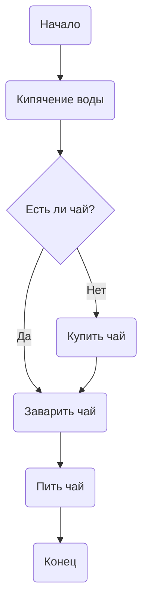
```mermaid
flowchart TD
A(Начало) --> B(Кипячение воды)
B --> C{Есть ли чай?}
  C -- Да --> D(Заварить чай)
  C -- Нет --> E(Купить чай)
  E --> D
  D --> F(Пить чай)
  F --> G(Конец)
```

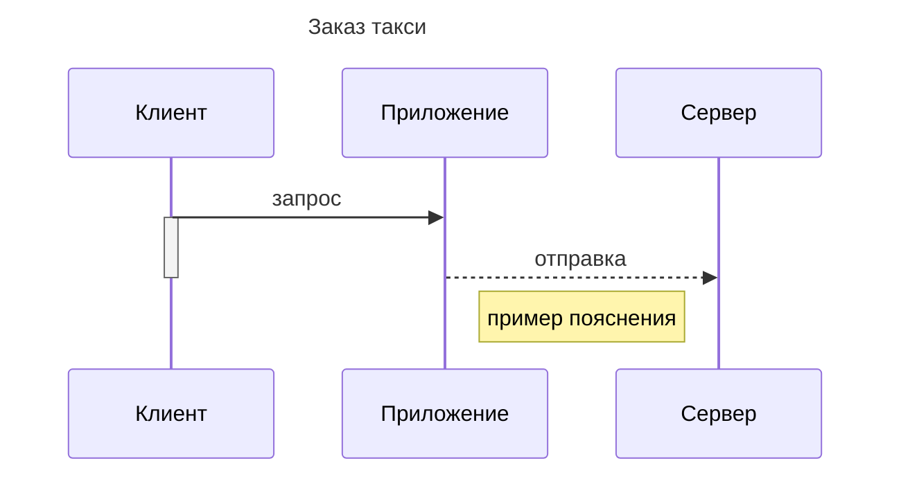
```mermaid
sequenceDiagram
    title Заказ такси
    participant Клиент
    participant Приложение
    participant Сервер
    Клиент->>Приложение: запрос
    activate Клиент
    Приложение-->>Сервер: отправка
    deactivate Клиент
    Note right of Приложение: пример пояснения

```
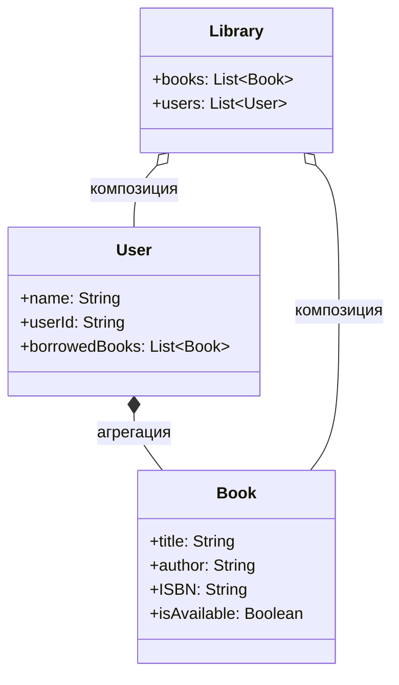
```mermaid
classDiagram
    class Book {
        +title: String
        +author: String
        +ISBN: String
        +isAvailable: Boolean
    }

    class User {
        +name: String
        +userId: String
        +borrowedBooks: List~Book~
    }

    class Library {
        +books: List~Book~
        +users: List~User~
    }

    User *-- Book : агрегация
    Library o-- Book : композиция
    Library o-- User : композиция

```
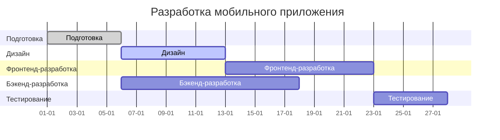
```mermaid
gantt
  title Разработка мобильного приложения
  dateFormat  YYYY-MM-DD
  axisFormat  %d-%m

  section Подготовка
  Подготовка: done,  prep, 2025-01-01, 5d

  section Дизайн
  Дизайн:active, design, after prep, 7d

  section Фронтенд-разработка
  Фронтенд-разработка: frontend, after design, 10d

  section Бэкенд-разработка
  Бэкенд-разработка: backend, after prep, 12d

  section Тестирование
  Тестирование: test, after frontend,  5d
```
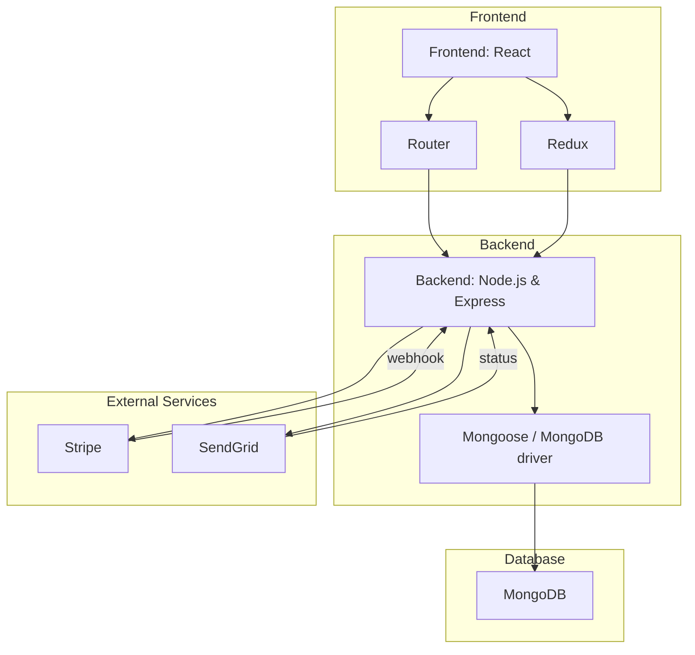
```mermaid
graph TD
  subgraph Frontend
    F[Frontend: React]
    R[Redux]
    Router[Router]
  end

  subgraph Backend
    B[Backend: Node.js & Express]
    M[Mongoose / MongoDB driver]
  end

  subgraph "External Services"
    Stripe[Stripe]
    SendGrid[SendGrid]
  end

  subgraph "Database"
    Mongo[MongoDB]
  end

  F --> R
  F --> Router
  Router --> B
  R --> B
  B --> M
  M --> Mongo

  B --> Stripe
  B --> SendGrid

  Stripe -- webhook --> B
  SendGrid -- status --> B


```
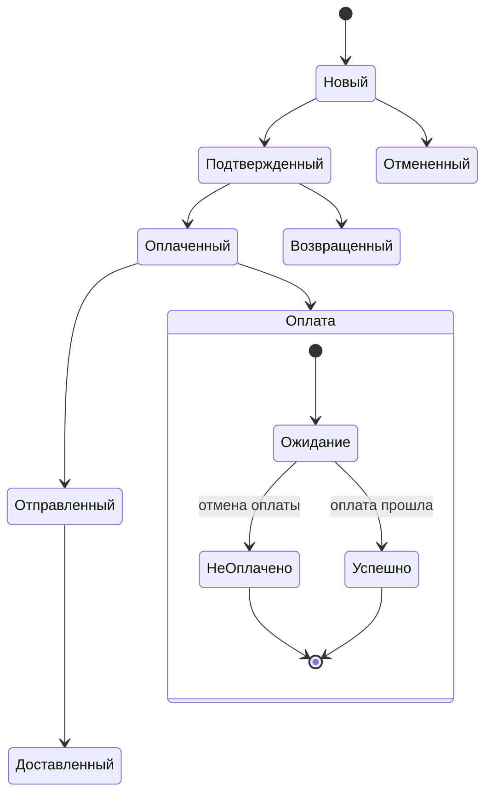
```mermaid
stateDiagram
  [*] --> Новый
  Новый --> Подтвержденный
  Подтвержденный --> Оплаченный
  Оплаченный --> Отправленный
  Отправленный --> Доставленный

  Новый --> Отмененный
  Подтвержденный --> Возвращенный

  state Оплата {
    [*] --> Ожидание
    Ожидание --> Успешно : оплата прошла
    Ожидание --> НеОплачено : отмена оплаты
    НеОплачено --> [*]
    Успешно --> [*]
  }

  Оплаченный --> Оплата

```
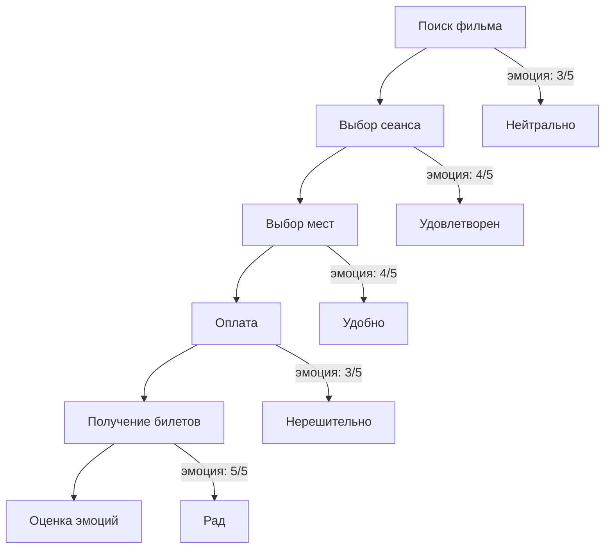
```mermaid
flowchart TD
    A[Поиск фильма] --> B[Выбор сеанса]
    B --> C[Выбор мест]
    C --> D[Оплата]
    D --> E[Получение билетов]
    E --> F[Оценка эмоций]

    %% Эмоции как подпункты (можно вынести в notes)
    A -->|эмоция: 3/5| A1[Нейтрально]
    B -->|эмоция: 4/5| B1[Удовлетворен]
    C -->|эмоция: 4/5| C1[Удобно]
    D -->|эмоция: 3/5| D1[Нерешительно]
    E -->|эмоция: 5/5| E1[Рад]

```
__________________________
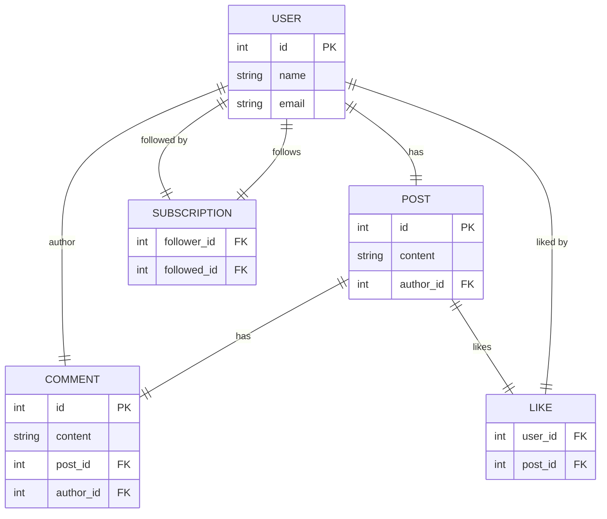
```mermaid
erDiagram
    USER {
        int id PK
        string name
        string email
    }

    POST {
        int id PK
        string content
        int author_id FK
    }

    COMMENT {
        int id PK
        string content
        int post_id FK
        int author_id FK
    }

    LIKE {
        int user_id FK
        int post_id FK
    }

    SUBSCRIPTION {
        int follower_id FK
        int followed_id FK
    }

    USER ||--|| POST : "has"
    POST ||--|| COMMENT : "has"
    USER ||--|| COMMENT : "author"
    USER ||--|| LIKE : "liked by"
    POST ||--|| LIKE : "likes"
    USER ||--|| SUBSCRIPTION : "follows"
    USER ||--|| SUBSCRIPTION : "followed by"

```
____________
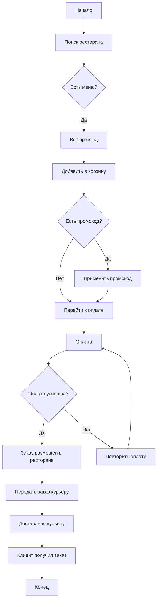
```mermaid
flowchart TD
  A[Начало] --> B[Поиск ресторана]
  B --> C{Есть меню?}
  C -- Да --> D[Выбор блюд]
  D --> E[Добавить в корзину]
  E --> F{Есть промокод?}
  F -- Да --> G[Применить промокод]
  F -- Нет --> H[Перейти к оплате]
  G --> H
  H --> I[Оплата]
  I --> J{Оплата успешна?}
  J -- Да --> K[Заказ размещен в ресторане]
  J -- Нет --> L[Повторить оплату]
  L --> I
  K --> M[Передать заказ курьеру]
  M --> N[Доставлено курьеру]
  N --> O[Клиент получил заказ]
  O --> P[Конец]
```
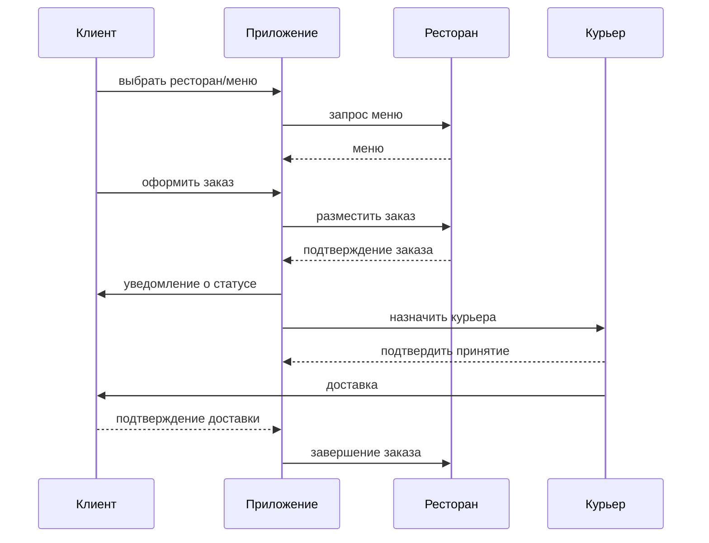
```mermaid
sequenceDiagram
  participant Клиент
  participant Приложение
  participant Ресторан
  participant Курьер

  Клиент->>Приложение: выбрать ресторан/меню
  Приложение->>Ресторан: запрос меню
  Ресторан-->>Приложение: меню
  Клиент->>Приложение: оформить заказ
  Приложение->>Ресторан: разместить заказ
  Ресторан-->>Приложение: подтверждение заказа
  Приложение->>Клиент: уведомление о статусе
  Приложение->>Курьер: назначить курьера
  Курьер-->>Приложение: подтвердить принятие
  Курьер->>Клиент: доставка
  Клиент-->>Приложение: подтверждение доставки
  Приложение->>Ресторан: завершение заказа

```
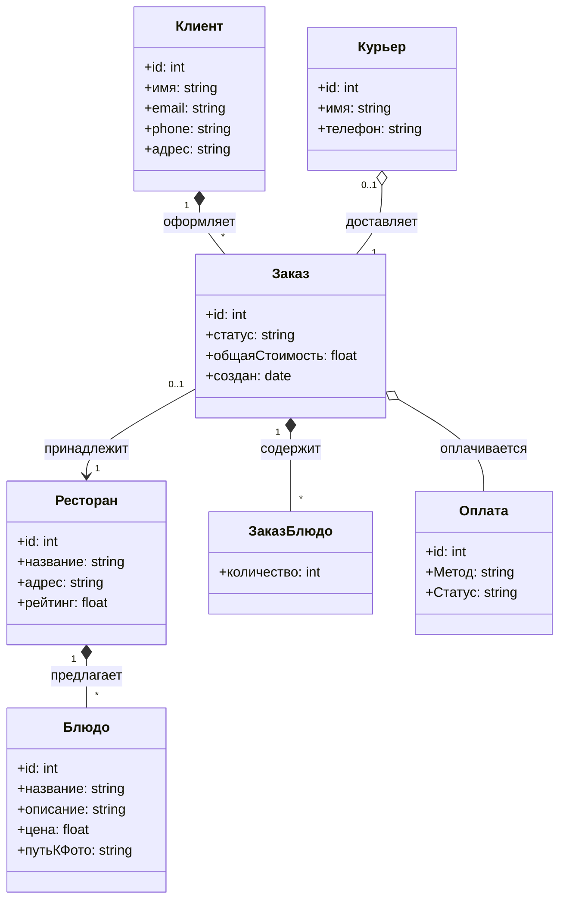
```mermaid
classDiagram
  class Клиент {
    +id: int
    +имя: string
    +email: string
    +phone: string
    +адрес: string
  }

  class Ресторан {
    +id: int
    +название: string
    +адрес: string
    +рейтинг: float
  }

  class Блюдо {
    +id: int
    +название: string
    +описание: string
    +цена: float
    +путьКФото: string
  }

  class Заказ {
    +id: int
    +статус: string
    +общаяСтоимость: float
    +создан: date
  }

  class ЗаказБлюдо {
    +количество: int
  }

  class Курьер {
    +id: int
    +имя: string
    +телефон: string
  }

  class Оплата {
    +id: int
    +Метод: string
    +Статус: string
  }

  Клиент "1" *-- "*" Заказ : оформляет
  Ресторан "1" *-- "*" Блюдо : предлагает
  Заказ "1" *-- "*" ЗаказБлюдо : содержит
  Заказ o-- Оплата : оплачивается
  Курьер "0..1" o-- "1" Заказ : доставляет
  Заказ "0..1" --> "1" Ресторан : принадлежит
```
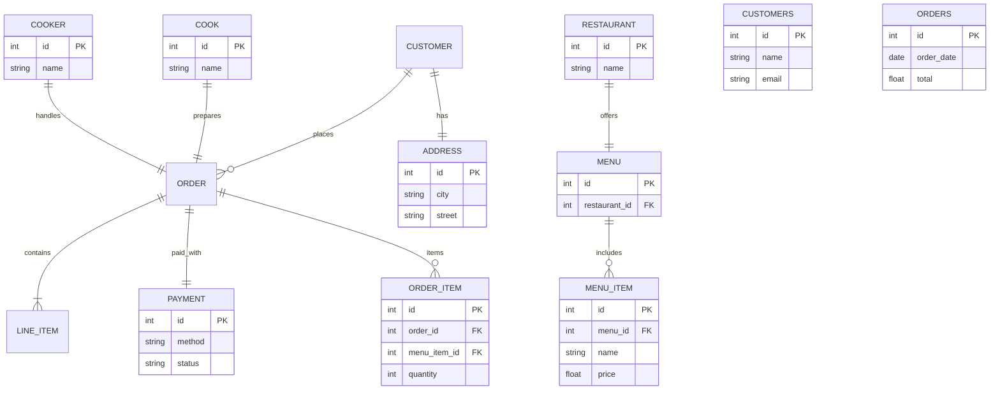
```mermaid
erDiagram
  CUSTOMER ||--o{ ORDER : places
  ORDER ||--|{ LINE_ITEM : contains
  ORDER ||--|| PAYMENT : paid_with
  CUSTOMER ||--|| ADDRESS : has
  RESTAURANT ||--|| MENU : offers
  MENU ||--o{ MENU_ITEM : includes
  ORDER ||--o{ ORDER_ITEM : items
  COOK ||--|| ORDER : prepares
  COOKER ||--|| ORDER : handles

  CUSTOMERS {
    int id PK
    string name
    string email
  }

  ORDERS {
    int id PK
    date order_date
    float total
  }

  PAYMENT {
    int id PK
    string method
    string status
  }

  ADDRESS {
    int id PK
    string city
    string street
  }

  RESTAURANT {
    int id PK
    string name
  }

  MENU {
    int id PK
    int restaurant_id FK
  }

  MENU_ITEM {
    int id PK
    int menu_id FK
    string name
    float price
  }

  ORDER_ITEM {
    int id PK
    int order_id FK
    int menu_item_id FK
    int quantity
  }

  COOK {
    int id PK
    string name
  }

  COOKER {
    int id PK
    string name
  }

```
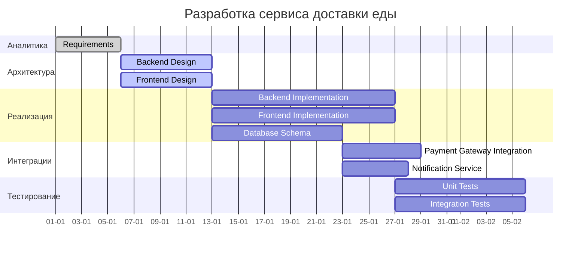
```mermaid
gantt
  title Разработка сервиса доставки еды
  dateFormat  YYYY-MM-DD
  axisFormat  %d-%m

  section Аналитика
 Requirements: done, req, 2025-01-01, 5d

  section Архитектура
 Backend Design: active, arch-backend, after req, 7d
 Frontend Design: active, arch-frontend, after req, 7d

  section Реализация
  Backend Implementation: backend, after arch-backend, 14d
  Frontend Implementation: frontend, after arch-frontend, 14d
  Database Schema: db, after arch-backend, 10d

  section Интеграции
  Payment Gateway Integration: integ, after db, 6d
  Notification Service: integ, after db, 5d

  section Тестирование
  Unit Tests: tests, after backend, 10d
  Integration Tests: integ-tests, after frontend, 10d
```
_____
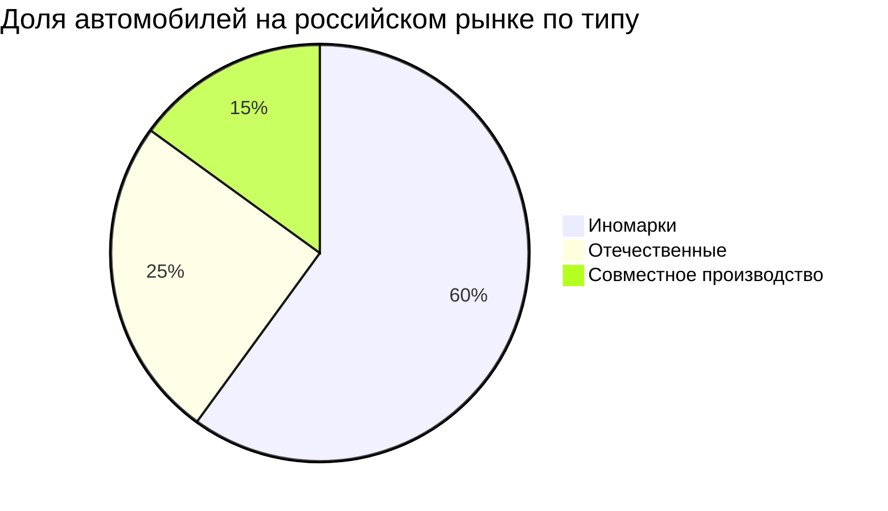
```mermaid
pie
  title Доля автомобилей на российском рынке по типу
  "Иномарки" : 60
  "Отечественные" : 25
  "Совместное производство" : 15

```